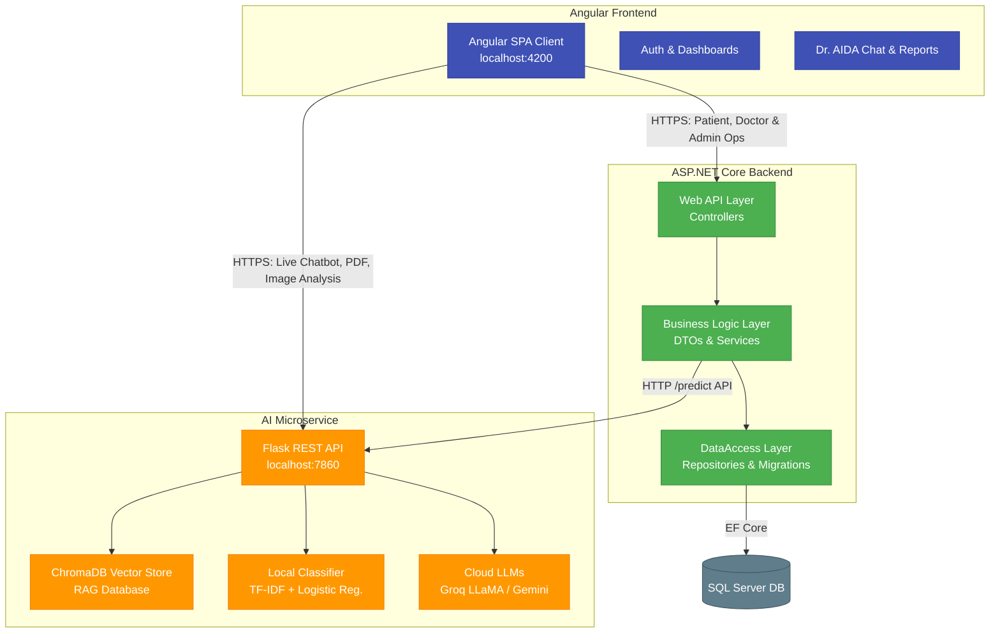

# 🏥 Medical Triage System - Graduation Project

Welcome to the **Medical Triage System**, a comprehensive, multi-layered graduation project designed to optimize medical consultations, patient management, and AI-driven symptom triaging. 

This repository is organized into three major components:
1. **Frontend**: A modern Angular-based Single Page Application (SPA).
2. **Backend**: A robust, three-layered ASP.NET Core Web API with Entity Framework Core and SQL Server.
3. **AI (Artificial Intelligence)**: A Flask-based REST API powering symptom classification (local machine learning models), interactive medical chatting (RAG with LLaMA 3.3 & Gemini), and medical PDF/image report analysis.

---

## 🏗️ Architecture & Interaction Diagram

The system follows a distributed client-server architecture where the Frontend client orchestrates features by communicating with both the primary Business Backend and the AI Microservice.



---

## 📂 Detailed Folder Structure

The project root contains three primary workspaces. Here is the layout of the files and directories:

```
GraduationProject/
│
├── Frontend/
│   └── MedicalFrontend/              # Angular SPA
│       ├── src/
│       │   ├── app/
│       │   │   ├── pages/            # View pages (Home, Login, Signup, chatbot, dashboard)
│       │   │   ├── components/       # Shared UI parts (Header, Footer, BackButton)
│       │   │   ├── services/         # Angular API endpoints & state services
│       │   │   ├── guard/            # Route authorization guards
│       │   │   ├── interceptors/     # JWT Token attachments
│       │   │   └── interfaces/       # Type definitions & Models
│       │   ├── environments/         # Configuration URLs (Dev vs. Prod)
│       │   ├── styles.css            # Base Stylesheets
│       │   └── index.html            # Entry HTML
│       ├── package.json              # Angular dependencies
│       └── tsconfig.json             # TypeScript configurations
│
├── Backend/
│   └── MedicalTriageSystem/          # C# .NET solution
│       ├── MedicalTriageSystem/      # Presentation Layer (Web API)
│       │   ├── Controllers/          # API Controllers (AI, Appointments, Doctor, Patients, etc.)
│       │   ├── Middleware/           # ErrorHandling & custom middleware
│       │   ├── Program.cs            # API bootstrap, dependency injection registry, and startup
│       │   └── appsettings.json      # Database connections & JWT secrets
│       │
│       ├── BusinessLogicLayer/       # Application Layer (Core Logic)
│       │   ├── Services/             # Service interfaces & implementations (AIService, AuthService)
│       │   ├── DTOs/                 # Data Transfer Objects
│       │   └── MappingProfile.cs     # AutoMapper DTO-Entity profiles
│       │
│       ├── DataAccessLayer/          # Persistence Layer (Data Access)
│       │   ├── Data/                 # DbContext, DataSeeder for seed roles/users
│       │   ├── Entities/             # Db Entities (User, Doctor, Patient, Appointment)
│       │   ├── Repositories/         # Repository implementation & Unit of Work pattern
│       │   └── Migrations/           # EF Core Database Migrations
│       └── MedicalTriageSystem.sln   # Solution File
│
└── AI/                               # Python AI System
    ├── Api/                          # Flask REST API
    │   ├── app.py                    # Main Flask entrypoint (handles chat, PDF report, images)
    │   ├── predict.py                # Command-line prediction script
    │   ├── medical_db/               # ChromaDB storage directory for medical context RAG
    │   ├── prompts/                  # System prompts & Agent instructions (Dr. AIDA)
    │   └── requirements.txt          # API dependencies (Flask, Groq, LangChain)
    │
    ├── Training/                     # Model Training Environment
    │   ├── train.py                  # Script to train vectorizer, triage, and specialty classifiers
    │   └── preprocess.py             # Data clean & symptom normalization algorithms
    │
    ├── Model/                        # Saved Model Artifacts
    │   ├── model.pkl                 # Triage urgency classifier
    │   ├── specialty_model.pkl       # Specialty classifier
    │   └── vectorizer.pkl            # TF-IDF Vectorizer
    │
    └── DataSet/                      # Dataset files
        └── symptoms.csv              # Medical Symptoms training CSV dataset
```

---

## ⚡ Tech Stack & Integrations

### 1. Frontend: Angular (SPA)
* **Framework**: Angular 17+ (TypeScript)
* **Routing**: Component-driven guards block unauthorized users from accessing Patient/Doctor dashboards.
* **Integrations**: 
  * Connects to C# backend on `http://medicalgraduation.runasp.net/api` (or localhost for dev).
  * Direct HTTP streaming or JSON uploads to the AI API on `http://localhost:7860/chat` for high-throughput responses.

### 2. Backend: ASP.NET Core Web API
* **Framework**: .NET 8.0
* **Architecture**: N-Tier (Separation of Concerns).
* **ORM**: Entity Framework Core with SQL Server.
* **Security**: ASP.NET Core Identity & JWT Bearer Token validation.
* **Services Integration**: Implements `IAIService` using `HttpClient` to relay local prediction requests (`POST /predict`) to the AI Flask server.

### 3. AI: Python, Flask & RAG
* **API Framework**: Flask with CORS enabled.
* **Primary LLMs**: Groq (LLaMA 3.3 70B & LLaMA 4 Scout Vision) with a Google Gemini fallback option.
* **Local Machine Learning**: Logistic Regression + TF-IDF Vectorizer trained on customized medical datasets for offline use.
* **RAG Engine**: Sentence Transformers (`all-MiniLM-L6-v2`) embedded into a local Chroma Vector Store database.
* **Parsing Utilities**: PyPDF2 + Groq Vision for scanning medical documents.

---

## 🚀 Setup & Execution Guide

To get the full system running locally, follow these steps in order:

### 1. Start the AI Server
1. Navigate to the `AI` directory:
   ```bash
   cd AI
   ```
2. Create and activate a Python virtual environment:
   ```bash
   python -m venv venv
   # Windows:
   .\venv\Scripts\activate
   # Linux/Mac:
   source venv/bin/activate
   ```
3. Install dependencies:
   ```bash
   pip install -r requirements.txt
   ```
4. Create an `.env` file inside the `AI/` directory with your API keys:
   ```env
   GROQ_API_KEY=gsk_your_groq_api_key
   GEMINI_API_KEY=AIzaSy_your_gemini_api_key
   ```
5. Run the Flask Server:
   ```bash
   cd Api
   python app.py
   ```
   *The server runs locally on **`http://localhost:7860`**.*

---

### 2. Start the Backend API
1. Open the solution file `Backend/MedicalTriageSystem/MedicalTriageSystem.sln` in Visual Studio or JetBrains Rider.
2. In `appsettings.json`, set the connection string under `DefaultConnection` to your local MS SQL Server.
3. Apply database migrations to seed tables:
   ```bash
   # In Package Manager Console:
   Update-Database
   # Or using dotnet CLI:
   dotnet ef database update --project DataAccessLayer --startup-project MedicalTriageSystem
   ```
4. Run the project `MedicalTriageSystem`.
   *The local API will start on **`http://localhost:5000`** (or HTTPS `https://localhost:7081`). Swagger documentation is available at `/swagger/index.html`.*

---

### 3. Start the Frontend Application
1. Navigate to the frontend directory:
   ```bash
   cd Frontend/MedicalFrontend
   ```
2. Install npm dependencies:
   ```bash
   npm install
   ```
3. Update API endpoints in `src/environments/environment.ts` if needed (defaults are set to point to local/staging environments).
4. Run the development server:
   ```bash
   npm run start
   # or
   ng serve
   ```
   *Open **`http://localhost:4200`** in your browser.*

---

## 🧑‍⚕️ Features Overview

* **Symptom Triage (Chatbot / AI)**: Allows patients to input their symptoms in English or Arabic, analyzes urgency levels (Critical, Moderate, Normal), recommends appropriate medical specialties, and offers self-care guidelines.
* **Lab Report Reader**: Allows patients to upload reports (PDFs or images) which are read and explained in simple, friendly Egyptian Arabic.
* **Identity Management**: Separate dashboards with custom actions for Patients, Doctors, and Administrators.
* **Appointments & Schedules**: Online scheduling, doctor profiles, and booking capabilities.

---

*This system serves as a graduation project for building modern, intelligent, and scalable medical helper platforms.*
